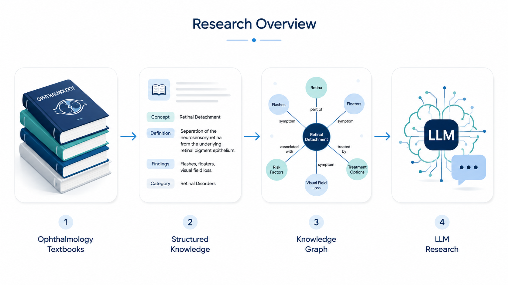
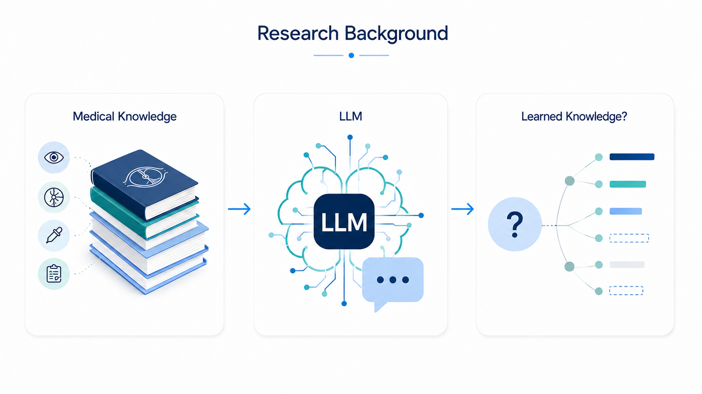
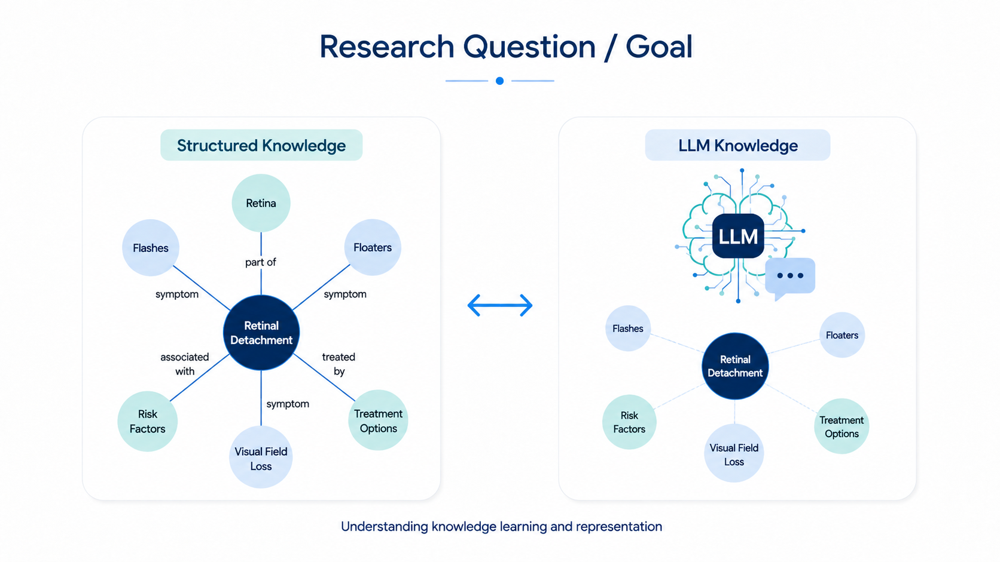
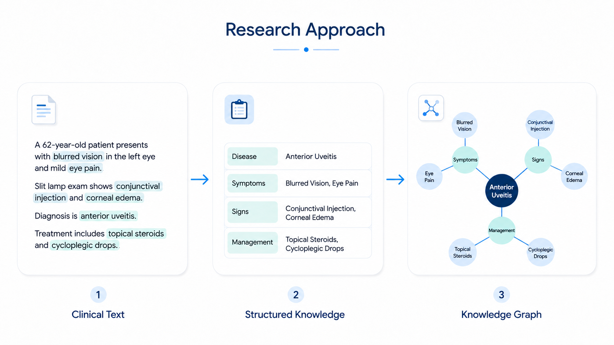
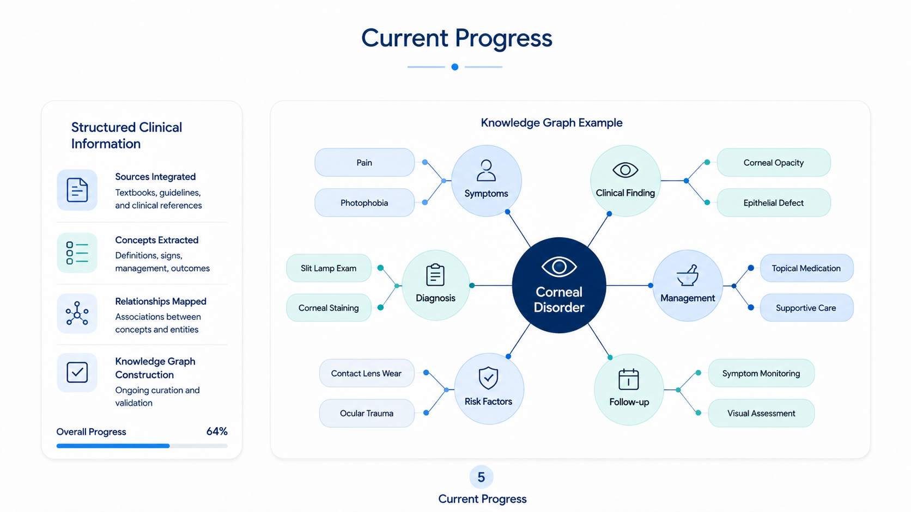
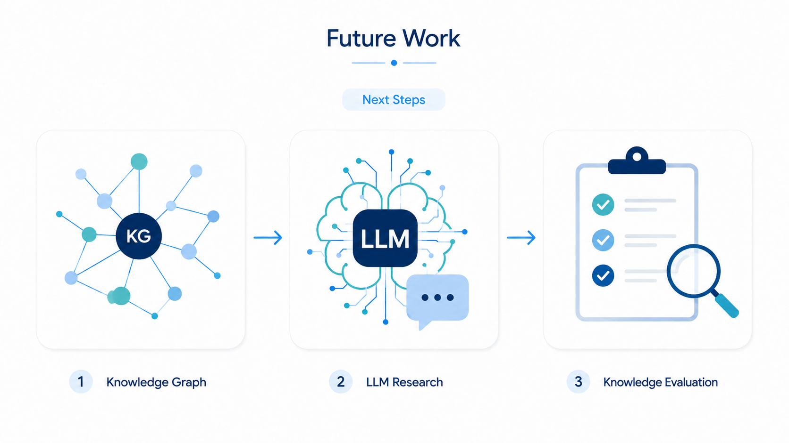

# 안과학 지식 구조화와 LLM의 지식 학습 평가에 관한 연구

### Structured Ophthalmic Knowledge for LLM Learning and Evaluation

본 연구는 안과학 교과서에 포함된 전문 의료 지식을 구조화하고, 이를 Knowledge Graph(KG)와 Large Language Model(LLM) 연구에 활용하는 것을 목표로 한다.

This project explores how specialized medical knowledge from ophthalmology textbooks can be structured and applied to Knowledge Graph (KG) and Large Language Model (LLM) research.

---

## Contents

1. [Research Overview | 연구 소개](#1-research-overview--연구-소개)
2. [Research Background | 연구 배경](#2-research-background--연구-배경)
3. [Research Question / Goal | 연구 질문 및 목표](#3-research-question--goal--연구-질문-및-목표)
4. [Research Approach | 연구 방법](#4-research-approach--연구-방법)
5. [Current Progress | 현재 진행 상황](#5-current-progress--현재-진행-상황)
6. [Future Work | 향후 연구 방향](#6-future-work--향후-연구-방향)

---

## 1. Research Overview | 연구 소개

**한국어**

본 연구는 안과학 교과서에 포함된 전문 의료 지식을 구조화하고, 이를 Knowledge Graph와 LLM 연구에 활용하는 방향을 탐색한다.

의료 지식을 보다 체계적으로 표현하고, 구조화된 지식이 LLM의 지식 학습과 표현을 이해하는 데 어떻게 기여할 수 있는지를 연구하고 있다.

**English**

This research focuses on structuring specialized medical knowledge from ophthalmology textbooks and exploring its use in Knowledge Graph and LLM research.

The study investigates how medical knowledge can be represented in a systematic form and how such structured knowledge can contribute to understanding knowledge learning and representation in LLMs.

---

## 2. Research Background | 연구 배경

**한국어**

LLM은 방대한 의료 문헌을 기반으로 학습할 수 있지만, 학습에 사용된 전문 지식이 실제로 모델 내부에 어떻게 반영되고 어느 정도 습득되었는지를 명확하게 이해하는 데에는 여전히 한계가 있다.

특히 의료 지식은 질환, 임상 소견, 진단, 치료 등 서로 연관된 정보로 구성되어 있기 때문에, 이를 구조적으로 표현하고 분석할 수 있는 접근이 중요하다.

**English**

Although LLMs can learn from large collections of medical literature, it remains challenging to clearly understand how specialized knowledge from these sources is reflected and acquired within the model.

Because medical knowledge consists of interconnected information involving diseases, clinical findings, diagnosis, treatment, and related concepts, structured methods for representing and analyzing these relationships are important.

---

## 3. Research Question / Goal | 연구 질문 및 목표

**한국어**

이 연구의 핵심 질문은 구조화된 의료 지식을 활용하여 LLM의 지식 학습을 어떻게 체계적으로 이해하고 평가할 수 있는가이다.

최종적으로는 안과학 지식을 구조적으로 표현하고, 이를 바탕으로 LLM이 전문 의료 지식을 학습하고 표현하는 과정을 정량적으로 분석할 수 있는 연구 기반을 마련하는 것을 목표로 한다.

**English**

The central question of this study is how structured medical knowledge can be used to systematically understand and evaluate knowledge learning in LLMs.

Ultimately, the goal is to establish a research foundation for representing ophthalmic knowledge in structured form and for quantitatively studying how LLMs learn and represent specialized medical knowledge.

---

## 4. Research Approach | 연구 방법

**한국어**

안과학 교과서의 임상 정보를 분석하여 주요 개념과 이들 사이의 관계를 구조화하고, 이를 Knowledge Graph 형태로 표현하는 연구를 진행하고 있다.

현재는 텍스트로 표현된 임상 정보를 연결된 지식 구조로 변환하는 데 초점을 두고 있으며, 향후 이러한 구조화 지식의 활용 가능성을 단계적으로 확장할 예정이다.

**English**

Clinical information from ophthalmology textbooks is analyzed and organized into structured representations of medical concepts and their relationships, including Knowledge Graphs.

The current work focuses on transforming clinical text into interconnected knowledge structures, while progressively exploring how these structured representations may later support LLM-oriented research.

---

## 5. Current Progress | 현재 진행 상황

**한국어**

현재 안과학 교과서에서 추출한 임상 정보를 기반으로 의료 지식을 구조화하고 Knowledge Graph를 구축하는 작업을 진행하고 있다.

임상 텍스트에 포함된 다양한 개념과 관계를 연결된 구조로 표현하고, 안과학 분야의 지식을 체계적으로 정리할 수 있는 방법을 검토하고 있다.

**English**

Currently, clinical information extracted from ophthalmology textbooks is being structured and represented as a Knowledge Graph.

The project is focused on organizing concepts and relationships from clinical text into connected knowledge structures and on investigating effective ways to represent specialized ophthalmic knowledge.

---

## 6. Future Work | 향후 연구 방향

**한국어**

향후에는 구축된 구조화 지식을 LLM 연구에 활용하여, 전문 의료 지식의 학습과 표현을 분석하는 방향으로 연구를 확장할 예정이다.

이를 통해 의료 분야에서 LLM이 학습한 지식을 보다 체계적이고 정량적으로 이해하고 평가할 수 있는 방법을 탐색하고자 한다.

**English**

Future research will explore how the constructed structured knowledge can be applied to LLM research, with a focus on understanding the learning and representation of specialized medical knowledge.

The long-term aim is to develop systematic and quantitative approaches for evaluating knowledge acquisition in medical LLMs.

